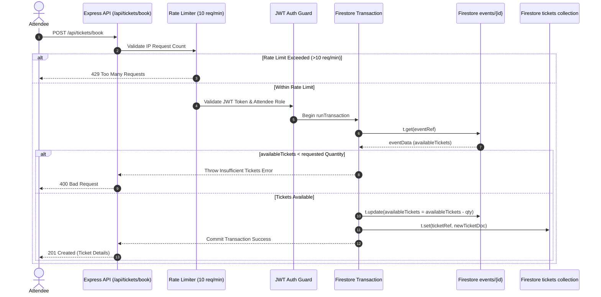

# Submission Documentation - Event Ticketing & Live Booking API

This document contains architectural details, collection record structure, Swagger UI OpenAPI 3.0 specification overview, and concurrency transaction diagrams for submission guidelines.

---

## 🏛️ Architecture Overview

```
assignment-12-event-ticketing-api/
├── config/
│   ├── firebaseConfig.js    # Firebase Admin SDK & Mock Firestore init
│   └── swagger.js           # Swagger OpenAPI 3.0 JSDoc configuration
├── controllers/
│   ├── authController.js    # User registration, login & profile
│   ├── eventController.js   # Event CRUD operations & filtering
│   └── ticketController.js  # Transactional ticket booking & cancellation
├── middleware/
│   ├── auth.js              # JWT Bearer token authentication
│   ├── checkRole.js         # Organizer vs Attendee RBAC guard
│   └── rateLimiter.js       # express-rate-limit (10 req/min scalper protection)
├── routes/
│   ├── authRoutes.js        # Auth endpoint routes & Swagger specs
│   ├── eventRoutes.js       # Event management routes & Swagger specs
│   └── ticketRoutes.js      # Ticket booking routes & Swagger specs
├── tests/
│   └── api.test.js          # Integration and concurrency test suite
├── .env.example             # Sample environment variables
├── .env                     # Local environment variables
├── .gitignore               # Git ignore rules
├── package.json             # NPM dependencies & scripts
├── README.md                # Full setup & API guide
└── server.js                # Express app entrypoint & Swagger mounting
```

---

## 🔄 Firestore ACID Transaction Flow (`db.runTransaction`)

### 1. Booking Ticket Flow (`POST /api/tickets/book`)
1. **Transaction Initialization**: A Firestore transaction block `db.runTransaction(async (t) => ...)` begins.
2. **Atomic Read**: Read `events/{eventId}` doc inside transaction.
3. **Availability Validation**: Check if `eventData.availableTickets >= quantity`.
   - If insufficient, throw error -> transaction rolls back automatically with no mutations applied.
4. **Atomic Decrement**: Call `t.update(eventRef, { availableTickets: eventData.availableTickets - quantity })`.
5. **Atomic Ticket Document Write**: Create a new document in `tickets` collection with unique `bookingRef` (e.g. `TKT-2026-88219`) and status `confirmed`.
6. **Commit**: Transaction commits atomically across both documents.



---

## 📚 Interactive Swagger UI Endpoint (`/api-docs`)

The interactive Swagger UI is mounted at `http://localhost:5000/api-docs` offering full OpenAPI 3.0 specs:

### OpenAPI Security Scheme
- **Scheme**: Bearer Token Authentication (`JWT`)
- **Header**: `Authorization: Bearer <token>`

### Core Tags Defined
1. **`Authentication`**: Registration (`/api/auth/register`), Login (`/api/auth/login`), Profile (`/api/auth/profile`).
2. **`Events`**: Public event listing (`/api/events`), Event details (`/api/events/{id}`), Organizer event CRUD, Organizer attendee view (`/api/events/{id}/attendees`).
3. **`Tickets`**: Attendee ticket booking (`/api/tickets/book`), Attendee my-tickets (`/api/tickets/my-tickets`), Ticket cancellation (`/api/tickets/{id}/cancel`).

---

## 🛡️ Scalper Protection & Rate Limiting

The `/api/tickets/book` route is protected by `express-rate-limit`:
- **Window**: 1 minute (`60000ms`)
- **Max Requests**: 10 requests per IP per minute
- **Exceeded Response**:
  ```json
  {
    "success": false,
    "message": "Too many booking attempts from this IP. Please try again after 1 minute."
  }
  ```
